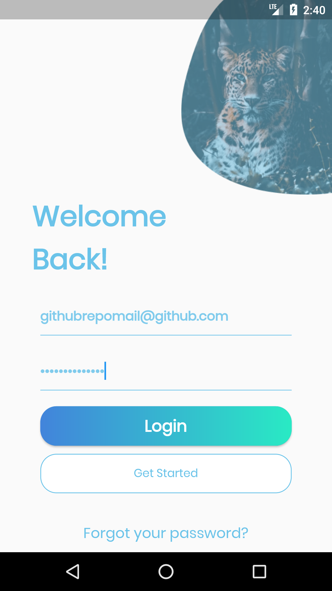
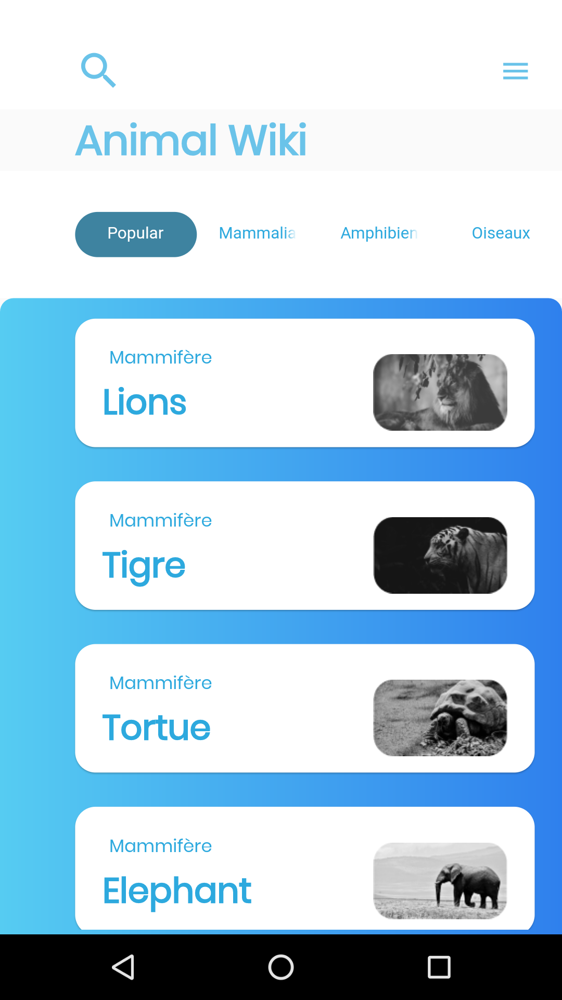
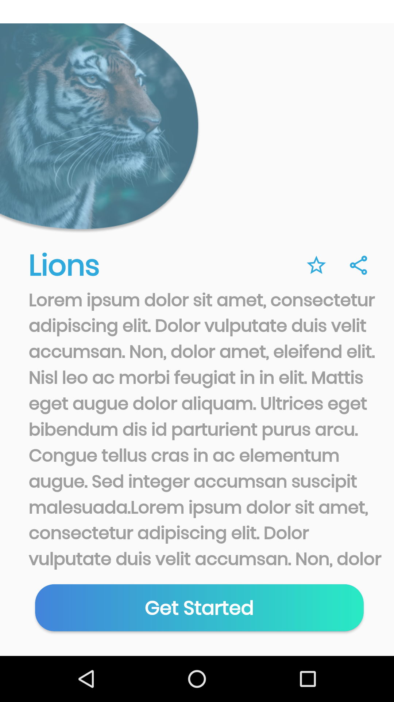

# Animal Wiki

Animal Wiki UI Desing.

Desing Link : https://www.figma.com/community/file/1056319708231930197
## Run Locally

Clone the project

```bash
  git clone https://github.com/yagizdo/Animal-Wiki
```

Go to the project directory

```bash
  cd Animal-Wiki
```

Install dependencies

```bash
  flutter pub get
```

Run app

```bash
  flutter run
```


## Screenshots
### Login Page


### Homepage


### Detail Page


